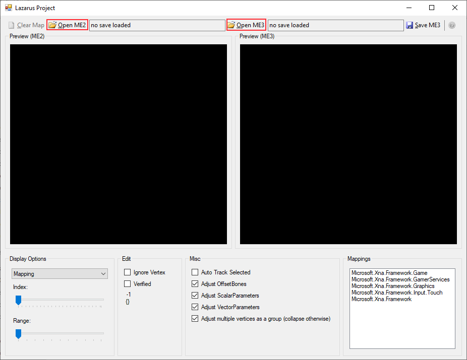
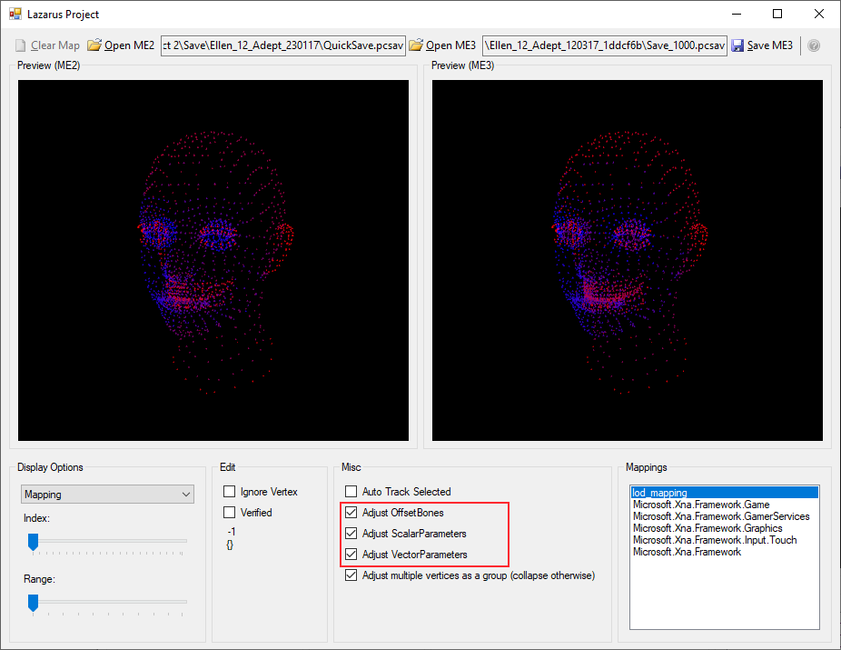

# Mass Effect 3 Lazarus Project
This repo is a manual import of original ME3 Lazarus project from https://code.google.com/p/me3-lazarus, with provided build instructions and built binaries.
No changes were made to the original source code other than shifting some directories for github publication. Therefore, *GPLv3* License file is provided for the Lazarus project itself, according to the original license at code.google.com; Gibbed.* libraries retain their *zlib* 
license. This "fork" is not maintained, and serves only as actualized backup from the times it was used once to fix the "face effect bug" when no working binary was present on the internet, circa 2012.
### Face Effect
The "face effect bug" is an unsatisfactory result for the process of importing ME2 character face geometry, originally imported from ME1, into ME3.

The LazarusProject.exe tool was developed to fix this, by exporting face geometry from ME2 save file into ME3 save file.

### How To Use

 - Download the necessary prerequisites:
   - Microsoft .Net Framework 4.0+ ([4.0 available here](https://www.microsoft.com/en-us/download/details.aspx?id=17851 "Microsoft .NET Framework 4 (Web Installer)")), it's automatically included with Windows 8+. You probably already have a compatible version. Latest version (4.8) is fine. Version 3.5 is a separate runtime.
   - Microsoft XNA 4.0 ([available here](https://www.microsoft.com/en-us/download/details.aspx?id=20914 "Microsoft XNA Framework Redistributable 4.0")), it's been deprecated since Windows 8, but it still works.
 - Download the [prebuilt binaries](https://github.com/aloraman/ME3-Lazarus/releases/download/v1.0/Binaries.zip) from this repo [releases](https://github.com/aloraman/ME3-Lazarus/releases) section, or build the project yourself.
 - Unzip the binaries with archive extraction tool (Windows built-in, WinRar, WinZip, etc...). Run the LazarusProject.exe executable
 
 

 - Open your ME2 and ME3 save files. (Back them up, just in case)

   

 - Check the additional options for exporting:
   - Adjust OffsetBones - copy the offset bones under the face for possibly better animation and structure.
   - Adjust ScalarParameters - copy will scalar parameters like skin and hair luminosity and reflectiveness.
   - Adjust VectorParameters - copy vector parameters like eye and hair color
 - Click "Save ME3". A message will pop up. Click OK. This will create or overwrite save file named `Save_1000.pcsav` in the directory of your ME3 save.

You can read the original how to use guide, as well as the history of fighting with "face effect bug" in the following blog: https://faceeffect.blogspot.com/

### How To Build
The original project was created using Visual Studio 2010, you can find up the original .sln file in [code.google.com archive](https://code.google.com/p/me3-lazarus) or in one of the many automatic exported versions here on github.
This repo has an updated .sln file for Visual Studio 2019. To create the binaries for the LazarusProject.exe you can just build the solution, using `LazarusProject` as startup project. 
The problem comes with `LodViewer` and `LodViewerContent` XNA projects, which are no longer supported in modern Visual Studio versions.
You can, however, manually install support for XNA into your VS2019 instance using the modified installer and some manual file copying. Look up the guide here: http://flatredball.com/visual-studio-2019-xna-setup/ 